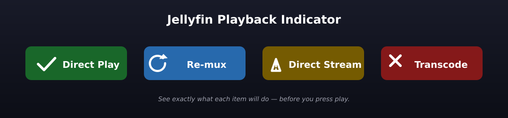

<p align="center">
  
</p>

# Playback Indicator

A Jellyfin server plugin that overlays a small badge on every episode and movie card showing *exactly* what the server would do at playback time on your current device — Direct Play, Re-mux, Direct Stream, or Transcode — without you having to press play.

## Features

- ✅ **Direct Play** / 🔁 **Re-mux** / ⚠️ **Direct Stream** / ❌ **Transcode** badges on cards, list rows, and the item details page
- Predictions match what playback would actually do — uses the **real** device profile (from `window.NativeShell.AppHost` on JMP/Android, or `/Sessions` for browsers), not a synthetic guess
- Hover any badge for a human-readable reason (e.g. *"video codec hevc not supported"*, *"audio channel count 6ch not supported"*)
- Per-item caching keyed by user + device + codec capabilities
- Honors the per-plugin Cache-TTL / Movies / Episodes settings from the dashboard

## Installation

1. Download the latest release from the [Releases page](https://github.com/Ibrahim-Aldhaheri/jellyfin-playback-indicator/releases)
2. In Jellyfin Dashboard → Plugins → Catalog → ⚙️ → Install from zip
3. Restart Jellyfin

## How It Works

The plugin's client-side JavaScript watches the DOM via `MutationObserver`. When new media cards or list rows appear, it:

1. Filters out non-playable items (series, seasons, collections, people, etc.) using `data-type` attributes and a cached type lookup
2. Per-item type lookups are coalesced into a single `/Items?Ids=…` batch per scan window
3. Calls `POST /Items/{id}/PlaybackInfo` for each playable item, with the **real** device profile and the user's actual `MaxStreamingBitrate`
4. Translates the server's `SupportsDirectPlay` / `SupportsDirectStream` / `SupportsTranscoding` flags into a badge, splitting `SupportsDirectStream` into 🔁 Re-mux vs ⚠️ Direct Stream by checking whether the source audio codec is in the device profile's audio whitelist

### Device profile accuracy

The prediction is only as good as the device profile we send. The plugin uses four sources, in order of preference:

1. **`window.NativeShell.AppHost.getDeviceProfile()`** — JMP, Android Mobile, Samsung Tizen, and LG webOS all expose this; it returns the *exact* profile the native player uses. This is the same call jellyfin-web itself makes to start playback in those shells.
2. **`GET /Sessions`** — for plain browsers, the server already has the profile that jellyfin-web posted via `/Sessions/Capabilities/Full` on connect. We pull it back out and use it.
3. **XHR + `fetch` sniffer** — every outgoing `POST /Items/{id}/PlaybackInfo` and `POST /Sessions/Capabilities/Full` is observed; the `DeviceProfile` and `MaxStreamingBitrate` from real player calls are captured and persisted to `localStorage`. This means as soon as you actually play *anything* on a fresh client, the next prediction is exact.
4. **Synthetic fallback** — last resort if all the above fail. Uses a permissive native-shell profile inside JMP/Android/Tizen/webOS, or a `canPlayType()`-derived browser profile elsewhere.

Results are cached in `localStorage` keyed by `itemId + userId + deviceId + codec-fingerprint` for 1 hour (configurable via the dashboard). The result cache is automatically invalidated when the captured device profile or `MaxStreamingBitrate` changes. Item types are cached for 24 hours.

## Building from Source

```bash
cd Jellyfin.Plugin.PlaybackIndicator
dotnet restore
dotnet build
```

The built `.zip` will be in `bin/Debug/net9.0/publish/`.

## Plugin Configuration

Settings are available in **Dashboard → Plugins → Playback Indicator**:

- **Cache TTL (minutes)**: How long to cache playback info per item (default: 60)
- **Show badge on movies**: Toggle movie library badges (default: on)
- **Show badge on episodes**: Toggle episode list badges (default: on)

## Badge Reference

| Status | Color | Meaning |
|--------|-------|---------|
| ✅ Direct Play | Green | File sent as-is — container, video, and audio all native to the device |
| 🔁 Re-mux | Blue | Container repackaged but video AND audio kept native — lossless, very low CPU on the server |
| ⚠️ Direct Stream | Amber | Video kept native, audio gets transcoded |
| ❌ Transcode | Red | Video re-encoded (and possibly audio too); most CPU-expensive |

### Re-mux vs Direct Stream

Jellyfin's PlaybackInfo API uses a single `SupportsDirectStream` flag for two distinct outcomes: **Re-mux** (container repackaged but video AND audio kept native — lossless, very low CPU) and **Direct Stream** (container repackaged, video kept native, audio transcoded). The plugin distinguishes them by checking whether the source audio codec is in any of the device profile's `DirectPlayProfiles` audio whitelists — if it is, audio passes through and you get 🔁; if not, audio is re-encoded and you get ⚠️.

### Why the badge can still be wrong

The prediction matches what the **server** would do — but the server can be wrong about what the client can actually play. The most common case is **MKV + HEVC in a desktop browser**: jellyfin-web's profile lists `mkv` as a direct-play container and Chrome reports HEVC as supported via `canPlayType`, but Chrome's MKV demux pipeline silently stalls on real-world 4K HEVC streams. The plugin tags these combos in the tooltip ("⚠ browser MKV demux of HEVC frequently stalls — try Jellyfin Media Player") so you're warned before pressing play.

## Supported Clients

The plugin runs inside `jellyfin-web`, so it works on every client that loads the web UI in a webview:

| Client | Plugin runs? |
|---|---|
| Any browser (Chrome, Firefox, Safari, Brave, Edge…) | ✅ |
| Jellyfin Media Player (desktop) | ✅ |
| Jellyfin Mobile (official Android webview app) | ✅ |
| Jellyfin Tizen (official Samsung TV) | ✅ |
| Jellyfin webOS (official LG TV) | ✅ |
| Swiftfin (official iOS / iPadOS / tvOS) | ❌ — fully native SwiftUI + VLCKit, no webview |
| Jellyfin for Android (the new native ExoPlayer-only app, ex-androidtv) | ❌ — no webview |
| Jellyfin Roku | ❌ — native BrightScript |
| Jellyfin Vue (alternative web client) | ❌ — separate codebase that doesn't load `jellyfin-web` |

This isn't a fixable bug for the unsupported clients — they don't load any HTML, so there's no place for a web plugin to inject. If you need badges in those, the only path is a feature request to the native client itself.

## Tech Stack

- C# .NET 9
- Jellyfin 10.11+ plugin APIs
- Vanilla JavaScript (no framework dependencies)
